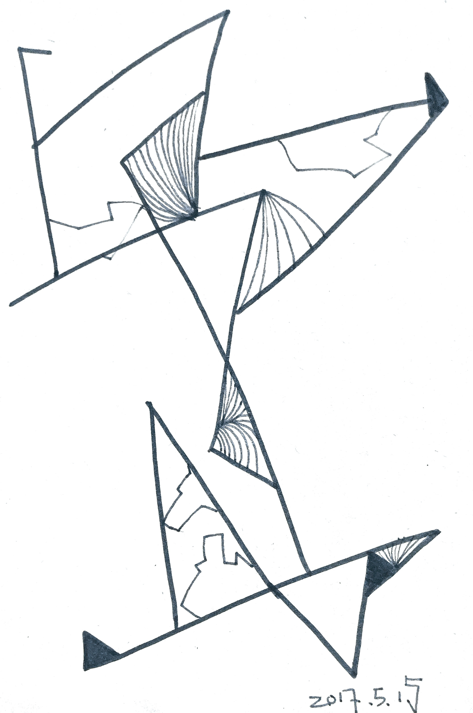
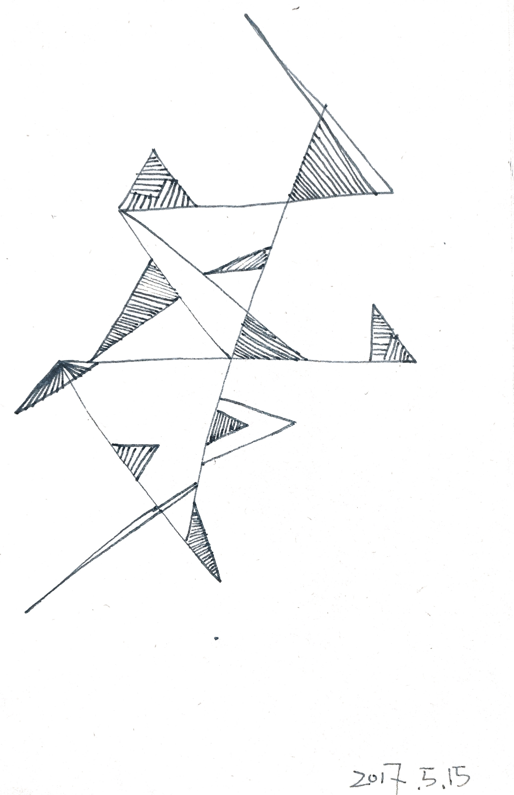
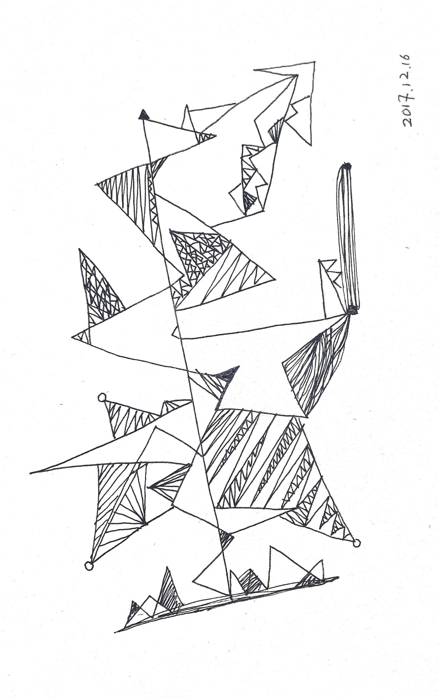
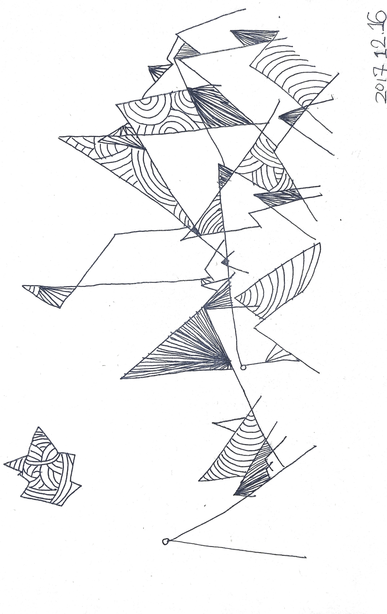
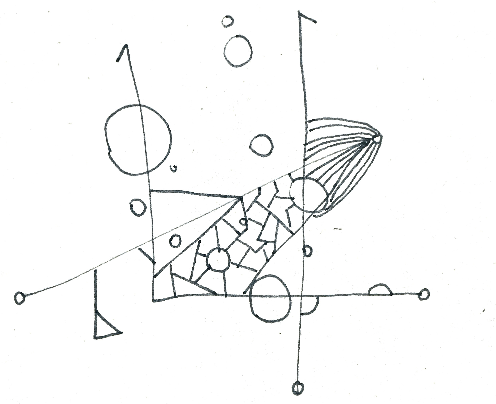
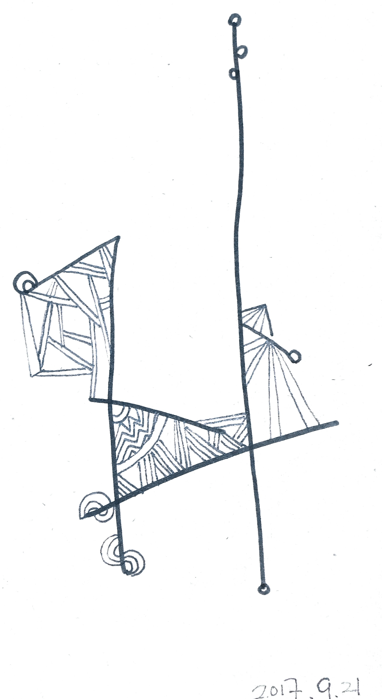
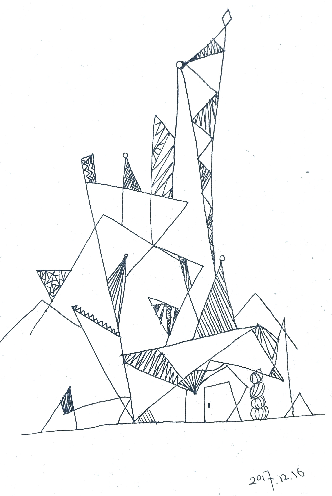
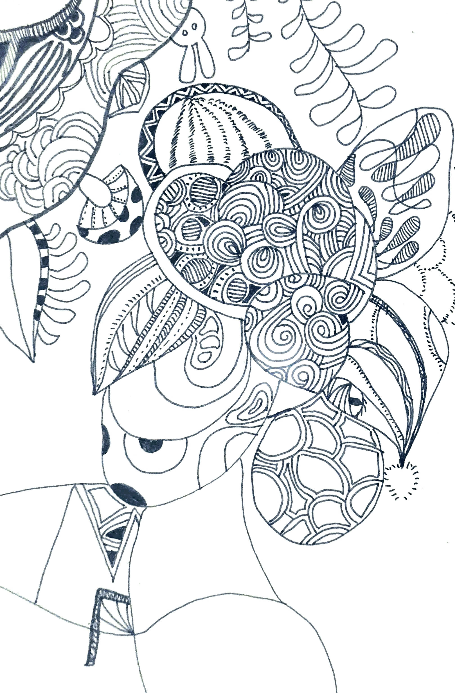
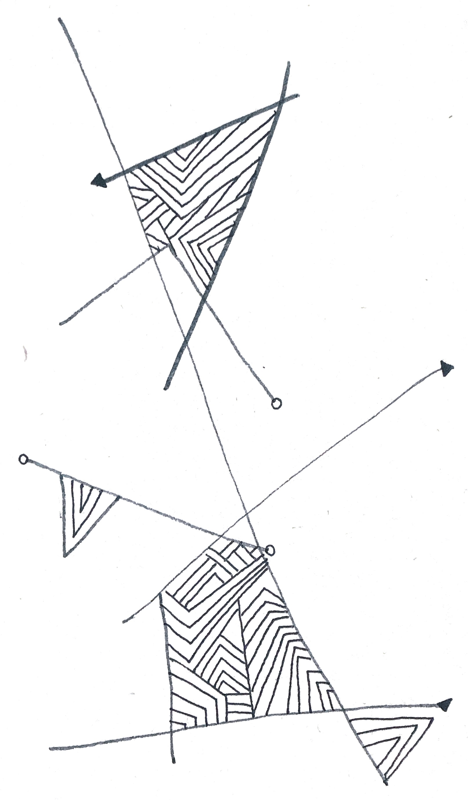
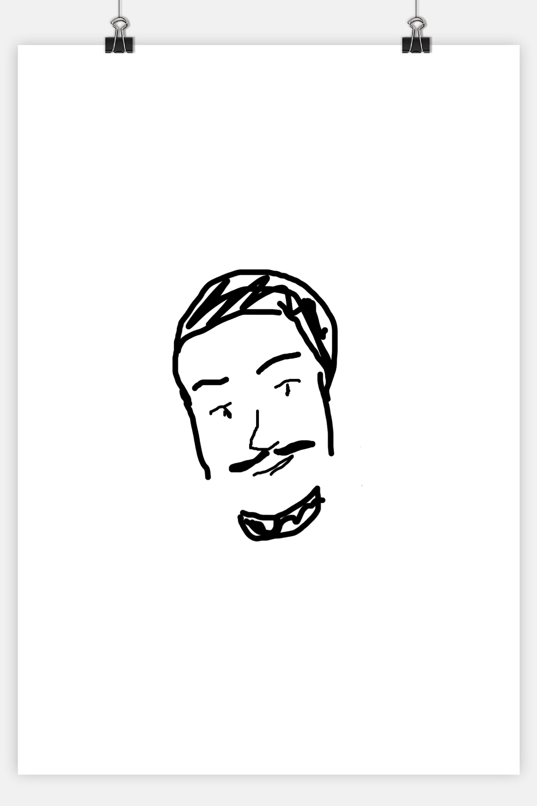

# 作品集综述
> 此作品集是笔者从耿大师处获取授权，将其过往作品收集珍藏于此。大师的作品有其独特鲜明的个人风格，相信读者在看过作品之后会有所体会。
<!--more-->
# 大师简介
> 耿大师，字九日，1995年生，出生于龙城近郊。自幼聪慧过人，儿时就表现出对绘画、设计浓厚的兴趣。
>耿大师早在2007年甚至之前就已经开始从事作品创作，以绘画各种富有设计感的服装为主，笔者有幸在2007-2010年期间目睹过大师的创作过程和部分作品，当时就觉得惊为天人，此次并没有收集到这些作品然让笔者深感遗憾。
>之后大师转战线描，以其独到的理解、精湛的技法赋予线条生命，让线条与线条之间产生碰撞，升华出美感。
> 近期，大师不满足于过往的成就尝试开辟新的领域，现已斥重金购买手绘板，并开始有部分作品问世。
# 近期作品
## 手绘
### 手绘-1
此作品是耿大师手绘处女作

### 手绘-2
此作品是耿大师自画像（Ps：真人比这还美哦）

# 早期作品
## 线描
### 线描-1

### 线描-2

### 线描-3

### 线描-4

### 线描-5

### 线描-6

### 线描-7

### 线描-8

### 线描-9

## 画像
### 画像-笔者
> 耿大师给笔者画的画像，emmmmm果然就算是耿大师的技巧也救不了我人丑啊

